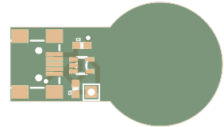

# Coin Cell Emulator

Tired of wasting Coin Cell batteries? With this CR2032 Coin Cell emulator you have an infintely charged battery, connected using USB mini. At Studio Sophisti (http://www.studiosophisti.nl/) we use this PCB intensively in order to reduce our battery consumption.

This product consists out of 2 PCB's that are stacked. If you produce them at 1.6mm thickness, they match exactly the CR2032 size.

### Partlist

- 2 1uF capacitor: Farnell 2496916
- 1 LP3985IM5-3.0 LDO: Farnell 1469153
- 1 MOLEX 67503-1020 Mini USB: Farnell 1125348

### PCB Preview

Generated with GerberTools from ThisIsNotRocketScience (https://github.com/ThisIsNotRocketScience/GerberTools), thanks Stijn!

